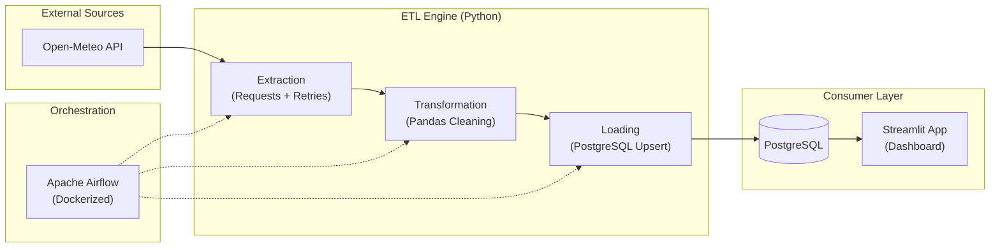

# 🌦️ End-to-End Weather ETL Pipeline

[](https://www.python.org/)
[](https://airflow.apache.org/)
[](https://www.postgresql.org/)
[](https://streamlit.io/)

Este proyecto implementa un pipeline de datos (ETL) completo y profesional. Automatiza la extracción de datos meteorológicos desde una API pública, su limpieza y normalización con Pandas, y su carga incremental en un almacén de datos PostgreSQL controlado por Airflow.


*Vista previa del dashboard interactivo generado con Streamlit.*

## 🚀 Arquitectura del Sistema

El flujo de datos sigue un diseño modular para garantizar la escalabilidad y mantenibilidad:



## 📂 Estructura del Proyecto

*   `dags/`: Definición de flujos de trabajo de Airflow (DAGs).
*   `src/`: Módulos principales del motor ETL (Extract, Transform, Load).
*   `app_viz.py`: Aplicación de visualización interactiva.
*   `docker-compose.yml`: Orquestación de contenedores (Airflow + Postgres).
*   `test_local.py`: Runner de pruebas unitarias para lógica de negocio.

## 🛠️ Stack Tecnológico

- **Lenguaje:** Python 3.x
- **Librerías ETL:** Pandas, Requests, SQLAlchemy
- **Base de Datos:** PostgreSQL 13
- **Orquestación:** Apache Airflow 2.7.1
- **Infraestructura:** Docker & Docker Compose
- **Visualización:** Streamlit & Plotly

## ⚙️ Configuración y Ejecución

### 1. Requisitos
- Docker y Docker Desktop
- Python 3.9+ (para ejecución local del dashboard)

### 2. Despliegue de Infraestructura
Levanta el ecosistema de Airflow y PostgreSQL:
```bash
docker-compose up -d
```
*El sistema inicializará automáticamente la base de datos y creará el usuario admin (`airflow`/`airflow`).*

### 3. Ejecución del Pipeline
1. Accede a Airflow en `http://localhost:8080`.
2. Activa y dispara el DAG `weather_etl_dag`.
3. Verifica los logs para asegurar que la carga incremental (Upsert) ha sido exitosa.

### 4. Visualización de Datos
Ejecuta el dashboard interactivo:
```bash
python -m streamlit run app_viz.py
```

## ✨ Buenas Prácticas Implementadas
- **Modularidad:** Separación de preocupaciones en capas E, T y L.
- **Resiliencia:** Reintentos automáticos con *Exponential Backoff* en la extracción.
- **Eficiencia:** Carga incremental mediante lógica **Upsert** (ON CONFLICT) para evitar duplicados.
- **Observabilidad:** Logs estructurados en cada etapa del proceso.
